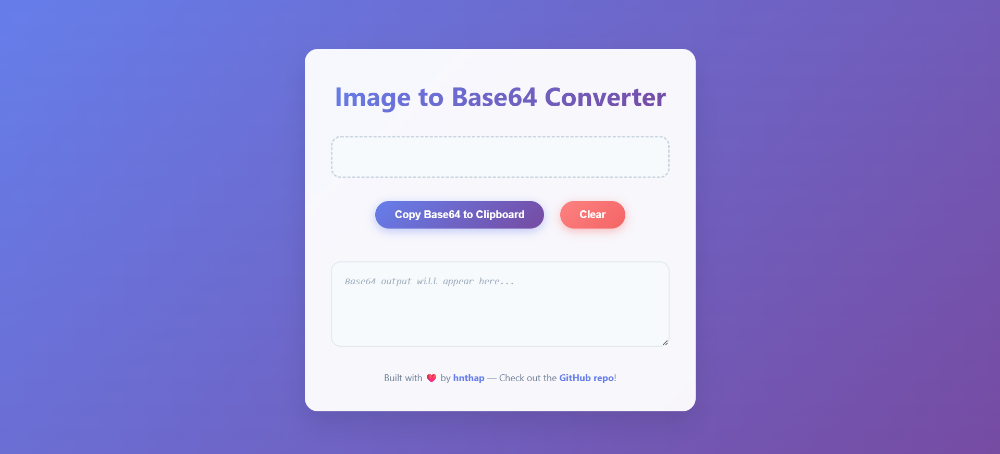

# Image to Base64 Converter

    

 

A lightweight, responsive **Image to Base64 Converter** built with **HTML, CSS, and JavaScript**.

👉 **[Live Demo](https://hnthap.github.io/image-to-base64/)**

## Features

* 📂 **Drag & Drop or Click to Upload** an image.
* 👀 **Live Preview** inside the upload area.
* ⚡ **Instant Base64 String Generation** in your browser.
* 🖱️ **One-click Copy & Clear** functions.
* 🔒 **Privacy First** — images never leave your device.
* 📱 **Responsive Design** for desktop & mobile.

## Supported Formats

This tool supports images including PNG, JPEG / JPG, WEBP, GIF, SVG, BMP, and so on. *(Most modern browser-supported image formats will work.)*

## How to Use

1. Clone this project to your machine.
2. Open `index.html` in your browser.
3. Upload an image (drag & drop or click).
4. Copy the generated Base64 string with one click.

## License

This project is licensed under the [MIT License](LICENSE).
